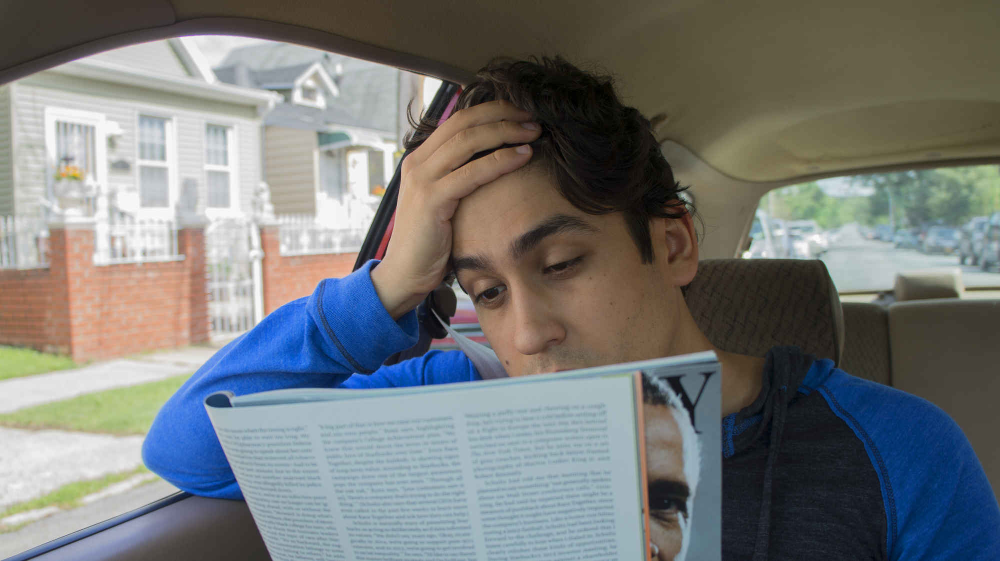

```{r, warning=FALSE, message=FALSE,echo=FALSE}
knitr::opts_chunk$set(echo = TRUE)
```

**This report takes a glimpse on different philosophy schools based on collected quotes, while focusing on comparing the two famous capitalism philosophers, Karl Marx and Adam Smith. The goal is to get a gentle taste of what Marx and Smith's topics are, as well as what emotions are associated with it.**

**The data set of this project, which contains roughly 360K philosophy quotes, can be found at <https://www.kaggle.com/datasets/kouroshalizadeh/history-of-philosophy>.**

**In short, each observation in this data set consist of a quote, its title, school and author. Due to the computational burden of such a giant data set, a portion of the analysis was conducted with a subset of the data, and it will be noted.**

This report is prepared with the following environmental settings and R version:

```{r echo=FALSE}
#print the current r version
print(R.version)
```

```{r check for required the packages, echo=FALSE, message=FALSE, warning=FALSE}
packages.used=c('tm','wordcloud','RColorBrewer','dplyr','tidytext','knitr','ggplot2','SnowballC','topicmodels','rvest','tibble','syuzhet','sentimentr','factoextra','scales','RANN','stringr','gplots','beeswarm')

packages.needed=setdiff(packages.used, 
                        intersect(installed.packages()[,1], 
                                  packages.used))

if(length(packages.needed)>0){
  install.packages(packages.needed, dependencies = TRUE)
}
```

```{r load the packages,warning=FALSE, message=FALSE,echo=FALSE}
library(tm)
library(wordcloud)
library(RColorBrewer)
library(dplyr)
library(tidytext)
library(knitr)
library(ggplot2)
library(SnowballC)
library(topicmodels)
library(rvest)
library(tibble)
library(syuzhet)
library(sentimentr)
library(factoextra)
library(scales)
library(RANN)
library(stringr)
library(gplots)
library(beeswarm)
```

```{r load the dataset, warning=FALSE, message=FALSE,echo=FALSE}
urlfile <- '../data/philosophy_data.csv'
dat <- read.csv(urlfile)
```

### **Question 1: Who are the contributors to the philosophy spikes across time span?**

Let's start with something simple here. Among the history of philosophy, are there certain times that people suddenly grew more interest in philosophy, which resulted in spikes of articles being published? If so, who are the philosophers that contributed in that span?

To start with, let's look at the time span of our data set.

```{r echo=FALSE, message=FALSE, warning=FALSE, paged.print=FALSE}
#get the unique pub_date from the dataset and sort
sort(unique(dat$original_publication_date))
```

A few charts can answer this simple question. Dividing the time span of the data set into before year 1000 and post 1000, I made graphs that account for a 100 year span.

```{r timedataframe, warning=FALSE, message=FALSE,echo=FALSE}
#first create a subset dataframe that is simpler for processing
timedf <- data.frame(dat$author,dat$school,dat$original_publication_date,dat$sentence_length )
colnames(timedf)<-c('author','school','pub_date','length')
```

```{r chart for pub_date <1000, warning=FALSE, message=FALSE,echo=FALSE}
#get subset of the df that has pub_date<1000
ancientdf <- subset(timedf,timedf$pub_date<1000)
#generate chart
ggplot(ancientdf,aes(x=ancientdf$pub_date))+
geom_bar(stat='count')+
coord_flip()+
theme_minimal()+
geom_text(stat='count', aes(label=..count..),hjust=0.51)+
xlab('Year')+
ylab('Number of Publications')
```

From this chart, we can see that the publications spiked at around 300 B.C., and it is not hard to tell that these are from the two great ancient philosophers, Plato and Aristotle.

```{r echo=FALSE, message=FALSE, warning=FALSE, paged.print=FALSE}
#get the possible author of the spikes around 300 B.C.
unique(subset(timedf,pub_date < (-300))$author)
```

```{r chart for pub_date between 1600 and 1700, warning=FALSE, message=FALSE,echo=FALSE}
#get subset of the df that has pub_date<1000
recent_df <-subset(timedf,pub_date >1600 & pub_date <1700)
#generate chart
ggplot(recent_df,aes(x=recent_df$pub_date))+
geom_bar(stat='count')+
coord_flip()+
theme_minimal()+
geom_text(stat='count', aes(label=..count..),hjust=0.51)+
xlab('Year')+
ylab('Number of Publications')
```

Here, the number of publications spiked around 1670-1690. without much knowledge on the history of philosophy, I extracted the contributors and their schools in this ten years.

```{r echo=FALSE, message=FALSE, warning=FALSE, paged.print=FALSE}
#get the possible author of the spikes around 300 B.C.
subset(timedf,pub_date < (1690) & pub_date > (1670)) %>%
select(c('author','school')) %>%
unique()
```

```{r chart for pub_date 1700~1800, warning=FALSE, message=FALSE,echo=FALSE}
#get subset of the df that has pub_date between 1700 to 1800
firstrecent_df <-subset(timedf,pub_date >1700 & pub_date <1800)
#generate chart
ggplot(firstrecent_df,aes(x=firstrecent_df$pub_date))+
geom_bar(stat='count')+
coord_flip()+
theme_minimal()+
geom_text(stat='count', aes(label=..count..),hjust=0.51)+
xlab('Year')+
ylab('Number of Publications')
```

Similarly, here the publications spiked around 1775 to 1800. The contributors and their associated schools are:

```{r echo=FALSE, message=FALSE, warning=FALSE, paged.print=FALSE}
#get the possible author around the spike
subset(timedf,pub_date < (1800) & pub_date > (1775)) %>%
select(c('author','school')) %>%
unique()
```

```{r chart for pub_date 1800~1900, warning=FALSE, message=FALSE,echo=FALSE}
#get subset of the df that has pub_date between 1800 and 1900
secondrecent_df <-subset(timedf,pub_date >1800 & pub_date <1900)
#generate chart
ggplot(secondrecent_df,aes(x=secondrecent_df$pub_date))+
geom_bar(stat='count')+
coord_flip()+
theme_minimal()+
geom_text(stat='count', aes(label=..count..),hjust=0.51)+
xlab('Year')+
ylab('Number of Publications')
```

Around year 1800 to 1900, the chart revealed two spikes. One is 1800 to 1825, with contributors:

```{r echo=FALSE, message=FALSE, warning=FALSE, paged.print=FALSE}
#get the possible author around the 1800 to 1825
subset(timedf,pub_date < (1825) & pub_date > (1800)) %>%
select(c('author','school')) %>%
unique()
```

The other is after 1875 up until 1900:

```{r echo=FALSE, message=FALSE, warning=FALSE, paged.print=FALSE}
#get the possible author around 1875 to 1900
subset(timedf,pub_date < (1900) & pub_date > (1875)) %>%
select(c('author','school')) %>%
unique()
```

```{r chart for pub_date 1900 beyond, warning=FALSE, message=FALSE,echo=FALSE}
#get subset of the df that has pub_date>1900
thirdrecent_df <-subset(timedf,pub_date >1900)
#generate chart 
ggplot(thirdrecent_df,aes(x=thirdrecent_df$pub_date))+
geom_bar(stat='count')+
coord_flip()+
theme_minimal()+
geom_text(stat='count', aes(label=..count..),hjust=0.51)+
xlab('Year')+
ylab('Number of Publications')
```

Starting from the 20th century, we can see that the number of publications has significantly increase on average, with no obvious spikes other than the year around 1950.

```{r echo=FALSE, message=FALSE, warning=FALSE, paged.print=FALSE}
#get the possible author around the spike
subset(timedf,pub_date < (1955) & pub_date > (1945)) %>%
select(c('author','school')) %>%
unique()
```

Besides from a general walk-through of the spikes of history and its contributors, another thing that came into mind is the length of the quotes. As a student, I used to spend tons of time on reading materials. It makes me imagine, if I was a philosophy majored student, which school of philosophy would bring the most trouble to me in terms of reading?



With the data set in our hand, it not hard to answer this question as well. Here is a graph of average quote length grouping by the school of philosophy.

```{r message=FALSE, warning=FALSE, include=FALSE, paged.print=FALSE}
#get a df w average sentence length group by school
mean_school <- aggregate(dat$sentence_length, list(dat$school), FUN=mean)
mean_school$x <- round(mean_school$x,digits=2)
colnames(mean_school)[2] <- "avg_sent_len"
colnames(mean_school)[1] <-"school"

```

```{r echo=FALSE, message=FALSE, warning=FALSE, paged.print=FALSE}
#graph of school v sentence length
ggplot(mean_school,aes(x=reorder(school,avg_sent_len),y=avg_sent_len))+
geom_bar(stat='identity',aes(fill=school))+
coord_flip()+
theme_minimal()+
geom_text(aes(label=avg_sent_len),size=3,hjust=2)+
scale_fill_viridis_d()+
xlab('average sentence length')+
ylab('school of philosophy')
```

From the graph, it reveals the top 3 school of philosophy with lengthy quotes are Capitalism, Empiricism and German Idealism. So, if I were a philosophy student who happens to know a bit about data science, I would probably avoid picking classes about these three topics.

**In short, there has been several period of time where publications of philosophic articles were published, and from a macro point of view, Capitalism, Empiricism and German Idealism seem to be the most lengthy schools of philosophy.**

### **Question 2: What are Philosophers talking about?**

For someone who has not been exposed to philosophy much, like me, it has always been a mystery what philosophers' topics are. Do different school discuss about similar matters in life? This question will be answered in this part of the report.

**Note: Due to the huge amount of data within the data set, only the top 3 schools that has the most quotes are studied in this part.**

To start with, we find the top 3 schools with the most quotes in our data set.

```{r echo=FALSE, message=FALSE, warning=FALSE, paged.print=FALSE}
###get the top 3 schools that has the most observation in the data set. 
top_3_school <- dat %>% 
  group_by(school) %>% 
  summarise(n = n()) %>% 
  arrange(desc(n)) %>% 
  head(3) %>%
  pull(school) %>% 
  as.list
top_3_school
```

Now with the top 3 schools, a word cloud will help visualize what words are used frequently in their quotes. One thing to note is that, two metrics of generating word cloud is used here. One is according to the frequency of usage, while the other is based on the irelative mportance of the words in a sentence, named tf-idf. More information about this metric can be found here:

<https://en.wikipedia.org/wiki/Tf%E2%80%93idf>

In general, in a word cloud, the bigger the font of a word represents more usage/importance.

Let's start with **Analytics**.

Here is a word cloud generated from quotes of the **Analytic** school, based on **frequency**.

```{r echo=FALSE, message=FALSE, warning=FALSE, paged.print=FALSE}
#sub set the dataset to contain analytic school
temp=subset(dat,dat$school=='analytic')
#prepare the corpus 
philo_corpus = Corpus(VectorSource(temp$sentence_str))
philo_corpus = tm_map(philo_corpus, content_transformer(tolower))
philo_corpus = tm_map(philo_corpus, removeNumbers)
philo_corpus = tm_map(philo_corpus, removePunctuation)
philo_corpus = tm_map(philo_corpus, removeWords, c("the", "and", stopwords("english")))
philo_corpus =  tm_map(philo_corpus, stripWhitespace)
#generate wordcloud based on freq
philo_dtm <- DocumentTermMatrix(philo_corpus)
philo_dtm = removeSparseTerms(philo_dtm, 0.99)
freq = data.frame(sort(colSums(as.matrix(philo_dtm)), decreasing=TRUE))
wordcloud(rownames(freq), freq[,1], max.words=50, colors=brewer.pal(4, "Spectral"))
```

Here is the word cloud based on the relative **importance** of a word within the sentences.

```{r echo=FALSE, message=FALSE, warning=FALSE, paged.print=FALSE}
#generate wordcloud based on tfidf metric
philo_dtm_tfidf <- DocumentTermMatrix(philo_corpus, control = list(weighting = weightTfIdf))
philo_dtm_tfidf = removeSparseTerms(philo_dtm_tfidf, 0.99)
freq = data.frame(sort(colSums(as.matrix(philo_dtm_tfidf)), decreasing=TRUE))
wordcloud(rownames(freq), freq[,1], max.words=50, colors=brewer.pal(4, "Spectral"))
```

One pattern that can be spotted from these two graphs is that, words like 'true', 'sentence', 'statements', 'proposition', 'meaning', 'sense' are frequently used, it seems like this school of philosophy put more emphasis on words, or sentences.

It matches the truth that Analytic philosophy is characterized by focusing on language, and the clarity and rigor language can brought to arguments. More information of this school of study can be find here, if interested: <https://en.wikipedia.org/wiki/Analytic_philosophy>

Now let's switch gear to **Aristotle**, and see what the founding father of philosophy has to see about our lives and the truth of the world.

Here is a word cloud generated from quotes of the **Aristotle** school, based on **frequency**.

```{r echo=FALSE, message=FALSE, warning=FALSE, paged.print=FALSE}
temp=subset(dat,dat$school=='aristotle')
philo_corpus = Corpus(VectorSource(temp$sentence_str))
philo_corpus = tm_map(philo_corpus, content_transformer(tolower))
philo_corpus = tm_map(philo_corpus, removeNumbers)
philo_corpus = tm_map(philo_corpus, removePunctuation)
philo_corpus = tm_map(philo_corpus, removeWords, c("the", "and", stopwords("english")))
philo_corpus =  tm_map(philo_corpus, stripWhitespace)
philo_dtm <- DocumentTermMatrix(philo_corpus)
philo_dtm = removeSparseTerms(philo_dtm, 0.99)
freq = data.frame(sort(colSums(as.matrix(philo_dtm)), decreasing=TRUE))
wordcloud(rownames(freq), freq[,1], max.words=50, colors=brewer.pal(4, "Spectral"))
```

Here is the word cloud based on the relative **importance** of a word within the sentences.

```{r echo=FALSE, message=FALSE, warning=FALSE, paged.print=FALSE}
philo_dtm_tfidf <- DocumentTermMatrix(philo_corpus, control = list(weighting = weightTfIdf))
philo_dtm_tfidf = removeSparseTerms(philo_dtm_tfidf, 0.99)
freq = data.frame(sort(colSums(as.matrix(philo_dtm_tfidf)), decreasing=TRUE))
wordcloud(rownames(freq), freq[,1], max.words=50, colors=brewer.pal(4, "Spectral"))
```

It is interesting to see how word clouds of Analytics and Aristotle differ. Instead of keywords associated with languages, Aristotle's quotes is more broad and has keywords like 'possible', 'animals', 'nature', 'movement', 'number', 'man', 'good', 'things' in it.

After researching, it turns out that Aristotle's writings cover a broad range of subjects including physics, zoology, math, economics, etc. Thus, the word clouds reveals the difference in topics of these two schools of study, to a certain degree.

More information about Aristotle can be find here:

<https://en.wikipedia.org/wiki/Aristotle>

Last but not least, we still have **German Idealism** left.

Here is a word cloud generated from quotes of the **German Idealism** school, based on **frequency**.

```{r echo=FALSE, message=FALSE, warning=FALSE, paged.print=FALSE}
temp=subset(dat,dat$school=='german_idealism')
philo_corpus = Corpus(VectorSource(temp$sentence_str))
philo_corpus = tm_map(philo_corpus, content_transformer(tolower))
philo_corpus = tm_map(philo_corpus, removeNumbers)
philo_corpus = tm_map(philo_corpus, removePunctuation)
philo_corpus = tm_map(philo_corpus, removeWords, c("the", "and", stopwords("english")))
philo_corpus =  tm_map(philo_corpus, stripWhitespace)
philo_dtm <- DocumentTermMatrix(philo_corpus)
philo_dtm = removeSparseTerms(philo_dtm, 0.99)
freq = data.frame(sort(colSums(as.matrix(philo_dtm)), decreasing=TRUE))
wordcloud(rownames(freq), freq[,1], max.words=50, colors=brewer.pal(4, "Spectral"))
```

Here is the word cloud based on the relative **importance** of a word within the sentences.

```{r echo=FALSE, message=FALSE, warning=FALSE, paged.print=FALSE}
philo_dtm_tfidf <- DocumentTermMatrix(philo_corpus, control = list(weighting = weightTfIdf))
philo_dtm_tfidf = removeSparseTerms(philo_dtm_tfidf, 0.99)
freq = data.frame(sort(colSums(as.matrix(philo_dtm_tfidf)), decreasing=TRUE))
wordcloud(rownames(freq), freq[,1], max.words=50, colors=brewer.pal(4, "Spectral"))
```

Compare these two word clouds with the previous word clouds, though a bit vague, we can still see how keywords are different from one another. Here, German Idealism has new keywords like 'concept', 'reason', 'relation', 'consciousness' and 'cognition', while some old keywords like 'nature', 'reason' are still used.

From a naive perspective, it seems to me that maybe German Idealism is somewhat related to psychology based on the word clouds.

Here is a quote online about the definition of 'idealism' in philosophy:

'The truth is, the philosophical meaning of idealism are those properties we discover in objects that are dependent on the way that those objects appear to us, as perceiving subjects. These properties only belong to the perceived appearance of the objects, and not something they possess "in themselves". '

More information about German Idealism can be find here:

<https://en.wikipedia.org/wiki/German_idealism#Meaning_of_idealism>

Again, through word clouds, we are able to have a gentle touch on the topics different schools of philosophy focuses on, some of them share common topics (Aristotle and German Idealism), while some of them are loosely related with others (Analytic).

### **Question 3: What is Capitalism?**

We all live in United States, a country that is characterized by the word 'capitalism'. Personally, I used to study Economics and Business, and the name 'Adam Smith' and 'Karl Marx' has been brought up countless times from my previous study. In this question, we will try to get a grasp on what is capitalism, as well as what Smith and Marx has to say about the society, and the emotions contained in their qutoes.

This question will be answered in two parts.

**Note: Due to the huge amount of data within the data set, only the a portion of Marx and Smith's quotes are used to analyze.**

#### Part 1: What is capitalism?

Before diving deep into analyzing Marx and Smith, we shall have a grand picture of what Capitalist were mainly discussing about.

Similarly, word cloud is handy in this context. Here are the word clouds for all quotes that are from the school '**capitalism**' in the data set. (Above based on **frequency**, below based on **importance**)

```{r echo=FALSE, message=FALSE, warning=FALSE, paged.print=FALSE}
temp=subset(dat,dat$school=='capitalism')
philo_corpus = Corpus(VectorSource(temp$sentence_str))
philo_corpus = tm_map(philo_corpus, content_transformer(tolower))
philo_corpus = tm_map(philo_corpus, removeNumbers)
philo_corpus = tm_map(philo_corpus, removePunctuation)
philo_corpus = tm_map(philo_corpus, removeWords, c("the", "and", stopwords("english")))
philo_corpus =  tm_map(philo_corpus, stripWhitespace)
philo_dtm <- DocumentTermMatrix(philo_corpus)
philo_dtm = removeSparseTerms(philo_dtm, 0.99)
freq = data.frame(sort(colSums(as.matrix(philo_dtm)), decreasing=TRUE))
wordcloud(rownames(freq), freq[,1], max.words=50, colors=brewer.pal(4, "Spectral"))
philo_dtm_tfidf <- DocumentTermMatrix(philo_corpus, control = list(weighting = weightTfIdf))
philo_dtm_tfidf = removeSparseTerms(philo_dtm_tfidf, 0.99)
freq = data.frame(sort(colSums(as.matrix(philo_dtm_tfidf)), decreasing=TRUE))
wordcloud(rownames(freq), freq[,1], max.words=50, colors=brewer.pal(4, "Spectral"))
```

Keywords like 'money', 'time', 'price', 'tax', 'labour', 'stock' reveals that capitalism is heavily inclined towards economics and business, just like we commonly know. Note that, the word 'country' appears in the word cloud based on **importance**, but not based on **frequency**. Sometimes the importance metric is able to catch those important keywords that got left out by the frequency metric.

Here is a formal definition of **Capitalism**:

**Capitalism** is an economy system based on the private ownership of the means of production and their operation for profit.

#### Part 2: What are Marx and Smith talking about? What sentiments are their quotes based on?

Two of the most well-known philosopher/economist under Capitalism are Karl Marx and Adam Smith.

In this part, we will dive deeper to analyze the topics of these two, as well as the sentiments contained in their articles.

First, let's look at the their word clouds based on **importance** only. The top graph is Marx and the bottom is Smith.

```{r echo=FALSE, message=FALSE, warning=FALSE, paged.print=FALSE}
temp=subset(dat,dat$author=='Marx')
philo_corpus = Corpus(VectorSource(temp$sentence_str))
philo_corpus = tm_map(philo_corpus, content_transformer(tolower))
philo_corpus = tm_map(philo_corpus, removeNumbers)
philo_corpus = tm_map(philo_corpus, removePunctuation)
philo_corpus = tm_map(philo_corpus, removeWords, c("the", "and", stopwords("english")))
philo_corpus =  tm_map(philo_corpus, stripWhitespace)
philo_dtm_tfidf = DocumentTermMatrix(philo_corpus, control = list(weighting = weightTfIdf))
philo_dtm_tfidf = removeSparseTerms(philo_dtm_tfidf, 0.99)
freq = data.frame(sort(colSums(as.matrix(philo_dtm_tfidf)), decreasing=TRUE))
wordcloud(rownames(freq), freq[,1], max.words=50, colors=brewer.pal(4, "Spectral"))
```

```{r echo=FALSE, message=FALSE, warning=FALSE, paged.print=FALSE}
temp=subset(dat,dat$author=='Smith')
philo_corpus = Corpus(VectorSource(temp$sentence_str))
philo_corpus = tm_map(philo_corpus, content_transformer(tolower))
philo_corpus = tm_map(philo_corpus, removeNumbers)
philo_corpus = tm_map(philo_corpus, removePunctuation)
philo_corpus = tm_map(philo_corpus, removeWords, c("the", "and", stopwords("english")))
philo_corpus =  tm_map(philo_corpus, stripWhitespace)
philo_dtm_tfidf = DocumentTermMatrix(philo_corpus, control = list(weighting = weightTfIdf))
philo_dtm_tfidf = removeSparseTerms(philo_dtm_tfidf, 0.99)
freq = data.frame(sort(colSums(as.matrix(philo_dtm_tfidf)), decreasing=TRUE))
wordcloud(rownames(freq), freq[,1], max.words=50, colors=brewer.pal(4, "Spectral"))
```

Comparing these two word clouds, the topics they covered are generally similar. Except Marx focus more on commodity and its production (keywords 'production', factory','commodity'...), while Smith focus his topic on a more macro perceptive, i.e., the market as a whole.('keywords 'market', 'trade', 'countries'...) They both studied the operation of an economy system, except variation on the scope and focus.

Now, to better understand what Marx and Smith's perspective, as well as how capitalism convey their ideas, a sentiment analysis is conducted on Marx and Smith's quotes. The sentiment analysis is based on a metric named NRC emotion lexicon, which contains the association of a word with eight basic emotions.

After analyzing individual quotes, here is a chart of the components of emotions in their quotes. The top is for Marx and the bottom is for Smith.

```{r message=FALSE, warning=FALSE, include=FALSE, paged.print=FALSE}
#create subset of dataframe for Marx and Smith and do sentiment analysis
marx2 <- subset(dat,author=='Marx')[1:2500,]
rownames(marx2) <- NULL
marx <- select(marx2,school,author,sentence_lowered,sentence_length)
#create the NRC sentiment df and combine it w the orginal df
marx_NRCdf <- get_nrc_sentiment(marx$sentence_lowered)
marx_emotiondf <- cbind(marx,marx_NRCdf)

smith2 <- subset(dat,author=='Smith')[1:2500,]
rownames(smith2) <- NULL
smith <- select(smith2,school,author,sentence_lowered,sentence_length)

smith_NRCdf <- get_nrc_sentiment(smith$sentence_lowered)
smith_emotiondf <- cbind(smith,smith_NRCdf)


```

```{r echo=FALSE, message=FALSE, warning=FALSE, paged.print=FALSE}
#generate plot of Marx emotion percentage
barplot(sort(colSums(prop.table(marx_emotiondf[, 5:12]))), 
  col='blue',
  horiz = TRUE,
  cex.names = 0.5,
  las = 1,
  main = "Emotions in Marx text", 
  xlab="Percentage")
```

```{r echo=FALSE, message=FALSE, warning=FALSE, paged.print=FALSE}
#generate smith emotion percentage
barplot(sort(colSums(prop.table(smith_emotiondf[, 5:12]))), 
  col='blue',
  horiz = TRUE,
  cex.names = 0.5,
  las = 1,
  main = "Emotions in Smith text", 
  xlab="Percentage")
```

From the two charts, we can see that Marx and Smith's quotes consist of similar sentiments. The top three sentiments contained are trust, anticipation and joy. It make sense because the trust and anticipation are essential for economy and business, while the large proportion of joy might portrays their positivism towards the society.

If one go down to the graph, it also reveals that relatively, Marx used more anger in his writing, while Smith 's contained more sadness.

Now, let's look at a few quotes that contained most emotions.

```{r message=FALSE, warning=FALSE, include=FALSE, paged.print=FALSE}
#generate new columns that are the summation of the eight emotion scores
smith_emotiondf$sum <- rowSums(smith_emotiondf[, c("anger","anticipation","disgust","fear","joy","sadness","surprise","trust")])

marx_emotiondf$sum <- rowSums(marx_emotiondf[, c("anger","anticipation","disgust","fear","joy","sadness","surprise","trust")])
```

Marx:

```{r echo=FALSE, message=FALSE, warning=FALSE, paged.print=FALSE}
#sort the dataframe and print top3 
marx_top3 <- marx_emotiondf %>% top_n(3,sum)
marx_top3$sentence_lowered
```

Smith:

```{r echo=FALSE, message=FALSE, warning=FALSE, paged.print=FALSE}
smith_top3 <- smith_emotiondf %>% top_n(3,sum)
smith_top3$sentence_lowered
```

In the end, let's see what are the relationship between each emotions. Thus, what's the association between pairwise emotions in their quotes? It shall help us better understand the sentiments contained in their quotes.

Such result can be achieved by a cluster analysis, in the following graph, the more reddish means stronger positive association, on the contrary, the more blueish the more negative association.

Marx:

```{r echo=FALSE, message=FALSE, warning=FALSE, paged.print=FALSE}
#heatmap based on marx emotion
heatmap.2(cor(marx_emotiondf%>%select(anger:trust)), 
          scale = "none", 
          col = bluered(100), , margin=c(6, 6), key=F,
          trace = "none", density.info = "none")

```

Smith:

```{r echo=FALSE, message=FALSE, warning=FALSE, paged.print=FALSE}
#heatmap for smith 
heatmap.2(cor(smith_emotiondf%>%select(anger:trust)), 
          scale = "none", 
          col = bluered(100), , margin=c(6, 6), key=F,
          trace = "none", density.info = "none")

```

Which make sense as the sentiments are roughly divided into two groups. A more positive end contains anticipation, joy, surprise and trust, while the more positive end contains anger, disgust, fear and sadness. Thus, it reveals the simple language structure that, given a quote has a bright context, more words related to anticipation, joy, surprise and trust are used while words contain anger, disgust, fear and sadness are not used, and vice versa.

### Conclusions:

As mentioned above, this report is only a gentle touch on philosophy based on the data set, with latter half focused on capitalism and two known philosophers, Adam Smith and Karl Marx. We were able to spot these patterns:

1.  During the history of philosophy, there have been spikes of philosophy publication. These schools and contributors are presented in detail.

2.  Different schools of philosophy prioritize different topics, as revealed by the keywords in word clouds. There are intersection among topics of schools, while there are also topics of schools that seems distantly related.

3.  Capitalism focus on business, economy and society as a whole.

4.  Adam Smith and Karl Marx's talks about similar matters, but their focus are somewhat different. Marx is more micro while Smith is more macro. In terms of sentiments, most of the quotes they published contains anticipation, trust and joy.

5.  The clustering of sentiments contained in the words of Marx and Smith's quotes proves a simple truth, that if a sentence has a positive mood, then more positive words tends to be used instead of negative words.
